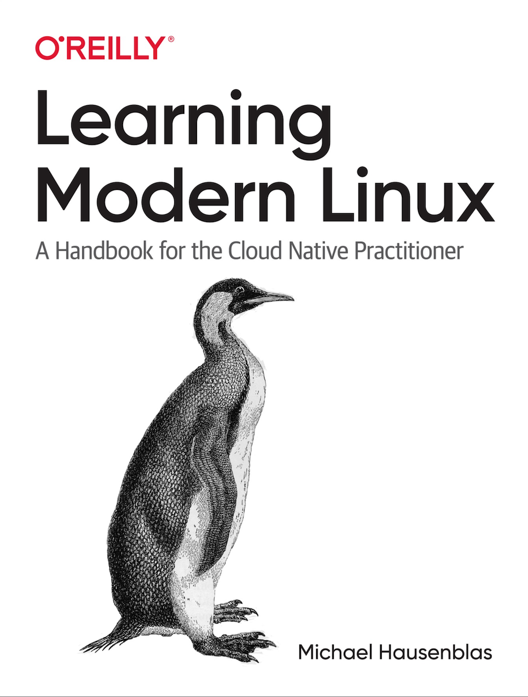

Whether you're new to Linux or have some experience, this practical book shows you how to master various tasks with this operating system
Cloud native professionals including developers, architects, DevOps practitioners, and site reliability engineers will learn how to use and 
program Linux in different modern environments, from embedded systems such as the Raspberry Pi to the virtual machine of your cloud provider of choice.

Along the way, you'll gain hands-on experience with modern terminals, shells, and commands, use Linux networking, and learn how to manage your workloads, 
all with the goal of implementing modern Linux observability. You'll also understand how to run Linux applications in modern ways by using containers, 
systemd, modern filesystems, and immutable distros such as Flatcar and Bottlerocket.

The book is currently in [Early Release at O'Reilly](https://learning.oreilly.com/library/view/learning-modern-linux/9781098108939/) and if you have feedback, 
please share via [modern-linux@pm.me](mailto:modern-linux@pm.me). 

## Coverage

* Chapter 1: Introduction to Linux
* Chapter 2: The Linux Kernel
* Chapter 3: Shells and Scripting
* Chapter 4: Access Control
* Chapter 5: Filesystems
* Chapter 6: Applications, Package Management & Containers
* Chapter 7: Networking
* Chapter 8: Observability
* Chapter 9: Advanced Topics
  * Inter-process Communication (IPC)
  * Virtual Machines
  * Modern Linux Distros
  * Selected Security Topics
  * Other Modern and Future Offerings
